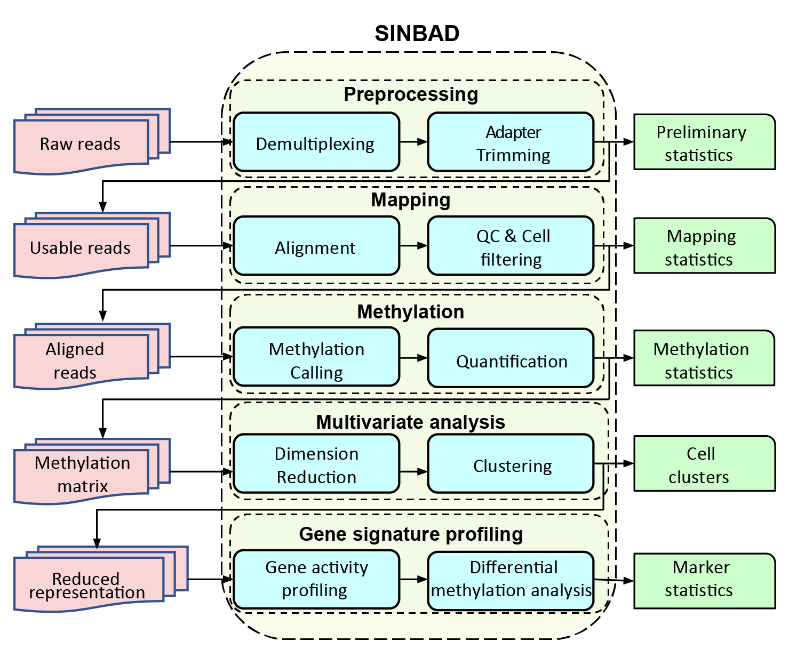
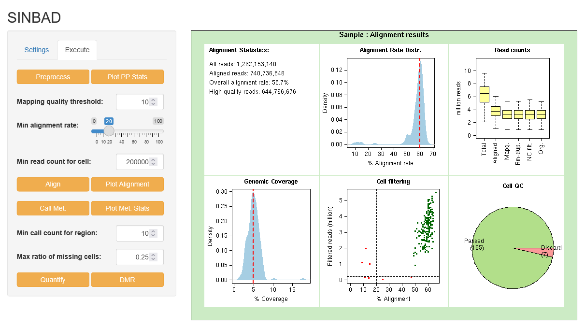

# SINBAD: A pipeline for processing SINgle cell Bisulfite sequencing samples and Analysis of Data

<!-- README.md is generated from README.Rmd. Please edit that file -->

SINBAD is an R package for processing single cell DNA methylation data.
It accepts FASTQ files as input, performs demultiplexing, adapter
trimmming, mapping, quantification, dimensionality reduction and
differential methylation analysis for single cell DNA methylation
datasets.

<p align="center">

</p>

NOTE: SINBAD is tested on paired snmC-Seq data.

## System requirements

R 3.6.0 or later version is required for installation.

## Installation

To install SINBAD, type the following command in R command prompt:

``` r
devtools::install_github("yasin-uzun/SINBAD")
```

Once you have installed the SINBAD, verify that it is installed
correctly as follows:

``` r
SINBAD::test()
```

If SINBAD is installed without any problems, you should see the
following message:

<br />

``` r
>SINBAD installation is ok.
```

## Dependencies

To run SINBAD, you need to have the underlying software:

-   Adapter Trimmer: Cutadapt or TrimGalor or Trimmomatic
-   Aligner: Bismark (with Bowtie) or BSMAP or BS3
-   Duplicate removal: samtools
-   Demultiplexer: demultiplex\_fastq.pl perl script (see below).

Note that you only need the tools you will use to be installed, i.e, you
don’t need BSMAP or BS3 if you will only use Bismark as the aligner.

You can install these tools by yourself. For convenience, we provide the
binaries in
[here](https://chopri.box.com/s/l8o4v6ko8aeabo3fsdtfan8gxjxzg39h) .
Please cite the specific tool when you use it, in addition to SINBAD.

You can download the perl scripts from our [repository](perl/). 

You also need genomic sequence and annotated genomic regions for
quantification of methylation calls. We provide the sequence data for
hg38 assembly in
[here](https://chopri.box.com/s/rf6fk2gumtbe3au83msxniwnkzkukvr5).

## Graphical User Interface

SINBAD has an easy to use Graphical User Interface (GUI). 

<p align="center">

</p>

## User Manual

Detailed instructions for using SINBAD are available in the [SINBAD User
Manual](docs/SINBAD_User_Manual.pdf).

## Configuration

To run SINBAD, you need three configuration files to modify:

-   `config.general.R` : Sets the progam paths to be used by MethylPipe.
    You need to edit this file only once.
-   `config.genome.R` : Sets the genomic information and paths to be
    used by MethylPipe. You need to generate one for each organism. We
    provide the built-in configuration by hg38.
-   `config.project.R` : You need to configure this file for your
    project.

You can download the templates for the configuration files from
[here](https://chopri.box.com/s/rkqnwx4ck7larpthluyxse4hi8quypk0) and
edit them for your purposes.

## Running

SINBAD is run in two steps:

1.  Read configuration files:

``` r
read_configs(config_dir)
```

`config_dir` should point to your configuration file directory
(mentioned above).

1.  Process data:

``` r
process_sample_wrapper(raw_fastq_dir, demux_index_file, working_dir, sample_name)
```

-   `raw_fastq_dir` should point to the directory containing FASTQ files
    as the input.
-   `demux_index_file` should point to the demultiplexing index file for
    the FASTQ files.
-   `working_dir` should point to the directory where all the outputs
    will be placed into.
-   `sample_name` (optional) is the name for the sample or project.

This function reads FASTQ files, demultiplexes them into single cells,
performs filtering, mapping (alignment), DNA methylation calling and
quantification, dimensionality reduction, clustering and differential
methylation analysis for the given input. All the outputs are placed
into related directories in `working_dir`.

## Example Data

For testing SINBAD, we provide [sample raw read (FASTQ)
data](https://chopri.box.com/s/7cu5cc655sq267o3pvdh29ar20n89nnw)

## Citation

If you use SINBAD in your study, please cite it as follows:

SINBAD: A pipeline for processing SINgle cell Bisulfite sequencing
samples and Analysis of Data , GitHub, 2021.

## Contact

For any questions or comments, please contact Yasin Uzun (uzuny at email
chop edu)
